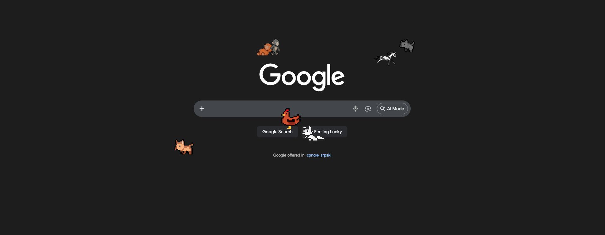
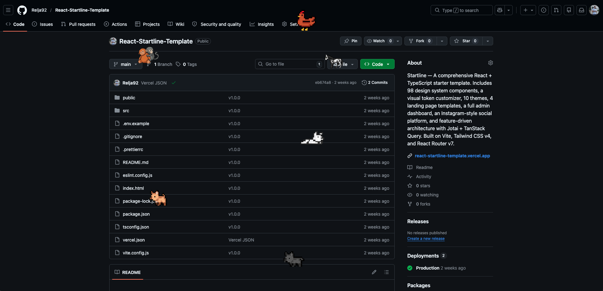

# PixelPals

Cute pixel art pet companions that live in your browser. They wander around web pages, react to your typing, watch videos with you, and say silly things when you click them.


## Screenshots




## Features

- **21 pet types** with 40+ color variants (dogs, foxes, pandas, skeletons, vampires, and more)
- **React to your activity** — pets run to your keyboard when you type, sit by videos you watch
- **Speech bubbles** — click any pet to hear what they're thinking (70 unique phrases per pet)
- **Hover interactions** — pets play with a ball when you hover, and lie down if you stay
- **Fully customizable** — name your pets, adjust speed, pick colors, choose which events they react to
- **Privacy-first** — zero data collection, no analytics, everything stays on your device
- **Lightweight** — runs at 60fps, <5ms per frame with 1 pet

## Install

### From Chrome Web Store
*Coming soon*

### From Source
```bash
git clone https://github.com/Relja92/PixelPals.git
cd PixelPals
npm install
npm run build:prod
```

1. Open `chrome://extensions/`
2. Enable **Developer mode** (top right)
3. Click **Load unpacked** → select the `build/` folder
4. Click the PixelPals icon in your toolbar to add pets

## Project Structure

```
src/
├── background/
│   └── service-worker.ts              Config storage + message routing
├── content/                           Injected into every page
│   ├── main.ts                        Entry point, init, boot
│   ├── types.ts                       PetConfig, PetState, BubbleData
│   ├── constants.ts                   Pet capability flags
│   ├── state.ts                       Shared mutable state
│   ├── phrases.ts                     70 phrases per pet type
│   ├── animation.ts                   60fps loop + animation state machine
│   ├── pet-creation.ts                DOM creation + smart reload
│   ├── helpers.ts                     Config, preload, event utilities
│   ├── events.ts                      Keyboard/video detection + cleanup
│   └── speech-bubbles.ts              Click-to-talk speech bubbles
└── ui/                                Popup configuration UI
    ├── main.ts                        Entry point
    ├── init.ts                        Init with loading/error states
    ├── types.ts                       Shared interfaces
    ├── constants.ts                   Pet emojis, colors, event labels
    ├── state.ts                       Popup state
    ├── storage.ts                     Chrome storage read/write
    ├── navigation.ts                  Page router + global controls
    ├── utils.ts                       capitalizeWords, getGifUrl
    ├── popup.html                     UI markup (4 pages)
    ├── popup.css                      Design system + styles
    └── pages/
        ├── home.ts                    Pet list with cards
        ├── add-pet.ts                 3-step add pet wizard
        ├── settings.ts                Per-pet configuration
        └── about.ts                   Credits + extension info
```

## Available Pets

| Pet | Colors | Hover Lie |
|-----|--------|:---------:|
| Dog | akita, black, brown, red, white | Yes |
| Fox | red, white | Yes |
| Chicken | brown, white | |
| Deno | green | |
| Panda | black, brown | Yes |
| Horse | black, brown, magical, paint_beige, paint_black, paint_brown, socks_beige, socks_black, socks_brown, warrior, white | |
| Monkey | gray | |
| Crab | red | |
| Clippy | black, brown, green, yellow | |
| Cockatiel | brown, gray | |
| Mod | purple | |
| Morph | purple | |
| Rat | brown, gray, white | |
| Rocky | gray | |
| Rubber Duck | yellow | |
| Skeleton | blue, brown, green, orange, pink, purple, red, warrior, white, yellow | |
| Snail | brown | |
| Snake | green | |
| Turtle | green, orange | Yes |
| Vampire | converted, countess, girl | |
| Zappy | yellow | |

## Build

```bash
npm run build          # Type-check + bundle + copy assets
npm run build:prod     # Build + minify + strip console logs
npm run watch          # TypeScript watch mode (type checking only)
```

**How it works:** `tsc --noEmit` checks types, then `esbuild` bundles each entry point (content script, popup, service worker) into a single IIFE. `terser` minifies for production.

## Contributing

We welcome contributions! See [CONTRIBUTING.md](CONTRIBUTING.md) for guidelines on:
- Setting up the dev environment
- Adding new pets (step-by-step)
- Code style rules
- Pull request process

## Architecture

```
Chrome Storage (sync + local)
       ↕
Service Worker (source of truth, validates config)
       ↕ chrome.storage.onChanged
Content Script (per tab — animation, events, rendering)
       ↕ chrome.runtime.sendMessage
Popup UI (config management, 4-page navigation)
```

- **Service Worker** validates all messages (sender ID, type whitelist, config structure)
- **Content Script** runs a 60fps animation loop, detects keyboard/video events, manages pet state
- **Popup** provides a multi-page UI for adding, configuring, and removing pets
- **esbuild** bundles each entry point into a single IIFE (no ES module imports in output)

## Security

- All user input rendered via `textContent` (no innerHTML with user data)
- Pet names sanitized: HTML characters stripped, max 50 chars
- Service worker validates sender ID on every message
- Password and credit card fields are ignored by keyboard detection
- Content Security Policy: `script-src 'self'`
- Zero external network requests

## Credits

Pet pixel art assets from the [VS Code Pets](https://github.com/tonybaloney/vscode-pets) project by [Anthony Shaw](https://github.com/tonybaloney):

| Artist | Pets | Profile |
|--------|------|---------|
| [Marc Duiker](https://twitter.com/marcduiker) | Clippy, Rocky, Zappy, Rubber Duck, Snake, Cockatiel, Crab, Mod | Twitter |
| [NVPH Studio](https://nvph-studio.itch.io/dog-animation-4-different-dogs) | Dog | itch.io |
| [Kevin Huang](https://github.com/kevin2huang) | Akita | GitHub |
| [Elthen](https://twitter.com/pixelthen) | Fox | Twitter |
| [Jessie Ferris](https://github.com/jeferris) | Panda | GitHub |
| [Chris Kent](https://github.com/thechriskent) | Horse, Skeleton | GitHub |
| [enkeefe](https://www.pixilart.com/draw) | Turtle | Pixilart |
| [Kennet Shin](https://github.com/WoofWoof0) | Snail | GitHub |
| [Karen Rustad Tolva](https://www.aldeka.net) | Crab (concept) | Website |
| Community contributors | Chicken, Deno, Monkey, Rat, Morph, Vampire | |

All pet assets licensed under MIT.

## License

MIT
